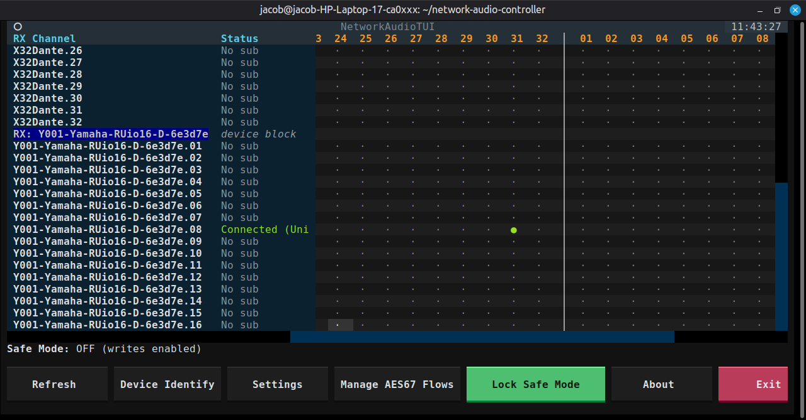

## Network Audio Controller (CLI + TUI)

This repository provides:

- `netaudio` (CLI)
- `netaudio-tui` (Textual TUI)

The TUI is focused on safe, operator-friendly Dante routing workflows and device inspection.

## TUI Preview

> Screenshot is from an earlier build, but gives a solid first impression of the UI.



## Current TUI Features

### Routing Matrix

- Routing matrix with single-click crosspoint actions
- Subscription status visualization in the matrix
- Non-blocking refresh pipeline with queued refresh handling
- Scroll/cursor/focus preservation after refresh
- Resizable matrix columns (`RX Channel`, `Status`)
- Sticky TX device header while horizontally scrolling

### Settings & Device Configuration

- Settings dialog for viewing detailed device information
- Async device info loading in the settings dialog
- Partial device configuration changes from the settings dialog (sample rate, encoding, latency, AES67 mode `Enabled` / `Disabled`)

### Other TUI Functions

- Safe Mode guard for write actions
- Manage AES67 Flows screen with clear mockup/upstream-limit hints

## Dependencies

### Required (all setups)

- Git
- Python 3.9+

### Recommended toolchain (`uv` path)

- `pipx`
- `uv`

Install on Debian/Ubuntu/Linux Mint:

```bash
sudo apt install pipx
pipx ensurepath
pipx install uv
```

Note: global `pip install uv` can be blocked on Debian/Ubuntu/Linux Mint (PEP 668 "externally managed environment"). `pipx` avoids that issue.

### Alternative toolchain (without `uv`)

- `python3-venv`
- `pip`

Install on Debian/Ubuntu/Linux Mint:

```bash
sudo apt install python3-venv
```

## Setup and Start

### 1) Clone repository

```bash
git clone https://github.com/jayxcfgj/network-audio-controller-tui.git
cd network-audio-controller-tui
```

### 2) Install dependencies and run

Option A: using `uv` (recommended)

```bash
uv sync
uv run netaudio-tui
```

Optional CLI check:

```bash
uv run netaudio --help
```

Option B: without `uv` (classic `venv` + `pip`)

```bash
python3 -m venv .venv
. .venv/bin/activate
pip install -e packages/netaudio-lib
pip install -e packages/netaudio
netaudio-tui
```

Optional CLI check:

```bash
netaudio --help
```

## Tests / Lint

```bash
uv run pytest
uv run ruff check .
uv run ruff format .
```

## Nodes

The app was made with heavy usage of various LLMs.
